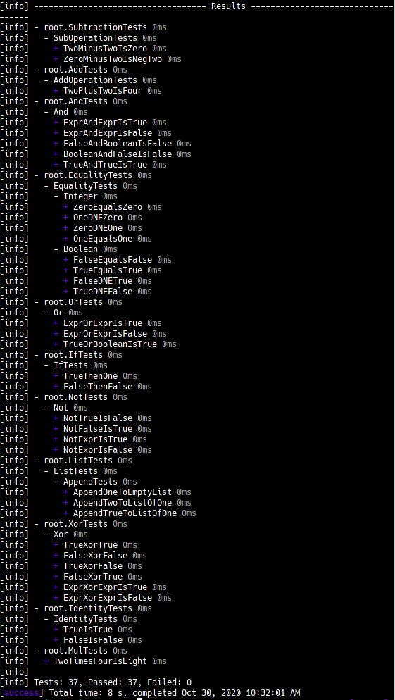

# Tiny Lang

The beginnings of a tiny interpreter written in Scala.

## Testing
Since there is no REPL for now, the interpreter is verified using unit tests. AST expressions are evaluated and the results are compared against expected results.

To start the tests:

```shell
> sbt test
```

Example Output:

